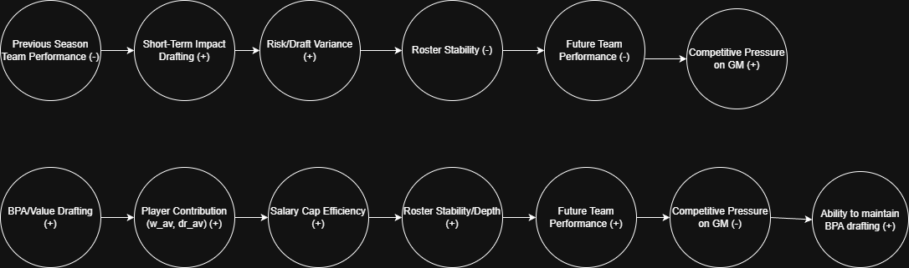

# Draft Strategy and Competitive Context in the NFL
Roster Building Under Constraint: 

## Decision

Should an NFL General Manager respond to short-term competitive pressure by prioritizing high-impact, high-variance positions in the draft, or follow a value-based strategy that maximizes long-term roster stability?

## Executive Summary

The NFL Draft forces general managers to balance long-term roster value against short-term pressure to improve team performance. This project examines how competitive context influences draft strategy and how prioritizing immediate results versus long-term positional value affects team stability and success.

The NFL Draft is one of the most consequential decision points for professional football franchises. Draft selections shape roster construction, salary cap efficiency, and competitive performance for years, yet they must be made under conditions of significant uncertainty. General managers operate under multiple constraints, including limited draft capital, the league’s salary cap, and pressure from ownership and fans to deliver results. For teams coming off poor seasons, these pressures are often heightened, increasing the urgency to pursue strategies that promise immediate improvement.

The core tension facing a general manager lies between two competing draft philosophies. One approach prioritizes long-term positional value, emphasizing positions that historically generate greater and more consistent career contributions relative to draft slot. This strategy seeks to maximize long-term roster stability and surplus value but may delay visible improvements in team performance. The alternative approach prioritizes immediate on-field improvement in response to short-term competitive pressure, favoring positions or player profiles perceived to contribute quickly, even when these choices involve higher risk or lower expected long-term return.

This decision matters because draft outcomes create feedback effects that extend beyond a single season. Draft strategy influences player development pathways, salary cap flexibility, team performance, and ultimately the job security of decision-makers themselves. Choices made under short-term pressure can reinforce cycles of instability, while value-based strategies may enable sustained competitiveness over time. By examining this tradeoff, the project seeks to clarify how competitive context shapes drafting behavior and how these decisions affect long-term team outcomes.

[Read more](Background.md)

# Exploratory Data Analysis

## Weighted NFL Draft Picks by Position (Adjusted for On-Field Positional Demand)

This visualization establishes the positional baseline of the draft dataset by showing how frequently each position appears after adjusting for the number of players typically on the field at that position. Rather than relying on raw draft counts alone, the metric uses a weighted calculation where the total number of drafted players at a position is divided by the number of players typically required at that position in a starting lineup. For reference, the weighting logic is based on the following assumptions: QB = 1, RB = 2, WR = 3, TE = 1, OT = 2, IOL = 3, EDGE = 2, IDL = 2, LB = 2, CB = 3, S = 2, and K, P, and LS = 1 each. This means positions with multiple on-field starters, such as cornerback (3) or wide receiver (3), have their total counts divided by three, while single-position roles like quarterback or tight end remain unchanged.

This adjustment matters for the decision-maker because it separates true positional investment from simple roster volume effects. For example, teams naturally draft more cornerbacks or wide receivers because more of them are required on the field at once. By normalizing for this, the visualization highlights which positions receive disproportionately high draft attention relative to their on-field demand. In the context of the research question, this helps a general manager understand which positions the league consistently prioritizes when building a roster. If high-impact positions such as EDGE or CB still rank highly even after normalization, it may indicate teams are willing to invest heavily in volatile, game-changing roles. Conversely, if more stable positions maintain strong representation, it may support a longer-term, value-based drafting strategy focused on roster stability rather than short-term competitive pressure.

### First Round NFL Draft Picks by Position (Non-Weighted)

his visualization shows the raw distribution of first-round draft selections by position. Unlike the earlier weighted chart, this graph presents the unadjusted count of players selected in the first round, highlighting where teams most frequently allocate their most valuable draft capital. Because the first round represents the highest-stakes portion of the draft, these selections provide a clear signal of which positions teams believe have the greatest potential impact on winning.

For a decision-maker, this chart reinforces the positional hierarchy commonly discussed in traditional football roster-building theory. Positions such as edge rusher, wide receiver, cornerback, offensive tackle, and quarterback appear most frequently in the first round, suggesting that teams consistently prioritize roles capable of creating significant on-field impact. This supports the earlier classification of these positions as high-value roles and suggests that general managers often respond to competitive pressure by targeting players at positions believed to offer the greatest competitive advantage.

## Average Player Value by Position (Weighted AV)

This visualization shows the average Weighted Approximate Value (AV) produced by players at each position across the dataset. Weighted AV is a metric derived from Pro Football Reference’s Approximate Value statistic, which estimates a player’s overall seasonal contribution to team success using box score production and team performance. In this analysis, AV values are averaged by position to compare the typical impact different position groups provide over time.

For a decision-maker, this chart helps identify which positions tend to deliver the greatest overall value once players reach the league. Quarterbacks clearly produce the highest average value, reinforcing why teams are willing to take significant risks drafting them early. However, positions such as offensive tackle, interior offensive line, edge rusher, and interior defensive line also generate consistently high value, suggesting that investing in foundational positions can provide reliable long-term returns. This helps frame the trade-off between pursuing high-impact but volatile positions and building roster stability through consistently productive roles.

### Average Player Value by Position in Round 1

This visualization shows the average Weighted Approximate Value (AV) produced by players selected in the first round, grouped by position. Weighted AV serves as a measure of a player’s overall on-field contribution, allowing for comparison of how much value first-round selections tend to generate across different positions. By focusing only on first-round picks, the chart highlights which positions deliver the greatest average return when teams invest their most valuable draft capital.

For a decision-maker, this chart provides insight into whether early draft investments align with the value those positions ultimately produce. Quarterbacks again generate the highest average value among first-round selections, reinforcing why teams are willing to prioritize them despite the associated risk. However, several other positions, including interior offensive line, running back, offensive tackle, and defensive line roles, also produce strong average value. This suggests that while teams often prioritize high-impact positions early in the draft, multiple foundational positions can also generate significant returns, providing an important perspective when balancing immediate impact with long-term roster stability.

### Average Player Value by Position in Rounds 2-7

This visualization shows the average Weighted Approximate Value (AV) produced by players selected in Rounds 2–7. Compared with the first-round chart, the overall values are significantly lower, reflecting the expected drop in average impact as the draft progresses. While quarterbacks produced the highest average value among first-round selections, their average contribution falls closer to the middle of the distribution in later rounds. Instead, positions such as interior offensive line, offensive tackle, and interior defensive line generate the highest average value outside of the first round.

For a decision-maker, this comparison highlights an important shift in where value tends to emerge across the draft. Early rounds are dominated by quarterbacks and other premium positions because of their potential to dramatically influence team success. However, in later rounds, more stable and structurally important positions along the offensive and defensive line tend to produce stronger average returns. This suggests that while teams often prioritize high-impact positions early in response to competitive pressure, long-term roster stability and value may increasingly come from identifying productive players at foundational positions deeper in the draft.

### Average Weighted Approximate Value by Draft Round and Position

This visualization shows how the average Weighted Approximate Value (AV) for each position changes across every round of the draft. Rather than comparing positions at a single draft stage, the chart illustrates how the expected value of players declines as the draft progresses and whether certain positions retain value deeper into the draft than others.

For a decision-maker, the key insight is the difference in how quickly positional value declines after the first round. While most positions show a steady drop in average value as rounds progress, the decline is particularly sharp for quarterbacks, highlighting the limited success of later-round quarterback selections. In contrast, several line positions, particularly along the offensive and defensive interior, maintain relatively stable value deeper into the draft. This suggests that while early picks may be best used to pursue positions with the potential to produce elite impact, later rounds may provide more dependable returns when focused on positions that consistently contribute to roster depth and structural stability.

## Change in Team Win Percentage After First-Round Draft Picks by Positional Value Tier

This visualization compares the year-over-year change in team win percentage for teams that used a first-round pick on a high-value position (QB, CB, WR, EDGE, OT) versus those that selected a lower-value position. Across the time period, teams drafting high-value positions tend to show smaller fluctuations and remain closer to neutral or modest improvements in win percentage. In contrast, teams selecting lower-value positions display larger swings, including both the strongest improvements and the sharpest declines. For a decision-maker, this suggests that drafting high-value positions in the first round may lead to more stable and predictable outcomes, while selecting lower-value positions appears to be associated with greater variability in team performance.

However, an important caveat is that stronger teams may have more flexibility in their draft decisions. Teams already performing well face less short-term competitive pressure and may be more willing to draft positions based on long-term roster balance rather than immediate impact. As a result, some of the volatility seen among teams selecting lower-value positions may reflect differences in team context rather than the positional value alone.

###  Change in Team Win Percentage After First-Round Draft Picks by Positional Value Tier (QB Isolated)

This visualization builds on the previous graph by isolating quarterbacks from the broader high-value positional category. In the earlier visualization, high-value positions appeared to produce relatively stable changes in win percentage compared to lower-value selections. However, once quarterbacks are separated from the group, it becomes clear that they are responsible for much of the volatility previously hidden within the high-value category.

Quarterback selections show the largest swings in both positive and negative changes in team win percentage, indicating a significantly higher level of risk compared to other premium positions. While successful quarterback picks can lead to substantial improvements in team performance, unsuccessful selections can coincide with sharp declines. In contrast, other high-value positions such as edge rusher, offensive tackle, and cornerback tend to produce more moderate and consistent changes in team performance. For a decision-maker, this distinction highlights that while premium positions generally provide stable returns, quarterback selections represent a uniquely high-risk, high-reward decision within first-round drafting.

### Change in Team Win Percentage After a Top 10 Pick

This visualization applies the same analysis as the earlier win-percentage charts but focuses only on teams selecting within the top 10 picks of the first round. Because these picks are typically held by weaker teams seeking immediate improvement, the chart helps assess whether selecting a high-value position leads to more consistent short-term gains compared to lower-value selections. Across the time period, teams selecting high-value positions show relatively moderate and stable changes in win percentage, generally remaining closer to neutral or modest improvement. In contrast, teams selecting lower-value positions display much larger fluctuations, including several of the most extreme positive and negative changes.

In the context of the project’s central question, this pattern is particularly meaningful because top-10 teams are most likely to be operating under significant short-term competitive pressure. The results suggest that selecting premium positions early in the draft may provide more predictable improvements in team performance, while using top picks on lower-value positions introduces greater volatility. This supports the broader argument that prioritizing high-impact positions—especially when draft capital is highest—may represent a more stable strategic approach for general managers attempting to accelerate team improvement.

### Change in Team Win Percentage After a Top 10 Pick (QB Isolated)

This visualization extends the top-10 pick analysis by separating quarterbacks from the rest of the high-value position group. Once quarterbacks are isolated, the most notable pattern is that teams selecting high-value non-quarterback positions show the greatest volatility in year-over-year win percentage, with both the largest positive spike and the sharpest decline in the chart. By comparison, the quarterback line appears more moderate, fluctuating around the middle without reaching the same extremes. Low-value positions also remain volatile, but not to the same degree as the non-quarterback high-value group.

In the context of the project, this complicates the idea that quarterback picks are always the riskiest top-10 decision. For teams drafting in the top 10, the biggest short-term swings in performance appear to come more often from selecting premium non-quarterback positions such as edge rusher, offensive tackle, cornerback, or wide receiver. This suggests that even when general managers avoid the unique pressure of drafting a quarterback, using elite draft capital on other premium positions can still produce highly uneven short-term results, reinforcing how uncertain it is to draft for immediate improvement at the top of the board.

## NFL Draft Strategy Dashboard — User Guide

### How to Use the App

1. **Select Filters (Left Sidebar)**

   * Choose one or more **positions** (e.g., EDGE, QB, WR)
   * Select **draft rounds** to compare early vs. late picks
   * Choose a **metric** for analysis

2. **View Overview Metrics**

   * The top section updates dynamically:

     * Total players
     * Average performance (Weighted AV)
     * Average games and seasons started

3. **Analyze Position Performance**

   * The chart compares average outcomes across positions
   * Use it to identify which positions generate the most value under different conditions

4. **Interpret Results**

   * Higher **Weighted AV** = stronger overall performance
   * Higher **value_per_pick** = greater efficiency relative to draft position
   * More games/seasons = higher reliability

---

### Important Caveat on *value_per_pick*

The **value_per_pick** metric measures efficiency by dividing player performance by draft position. While useful for identifying “high-value” picks, it has important limitations:

* It can **inflate the value of late-round picks**, since even modest performance divided by a large pick number appears efficient
* It may **undervalue early picks**, which are expected to produce higher absolute performance
* It should be interpreted as a measure of **relative efficiency**, not overall player quality

As a result, value_per_pick should be used alongside metrics like **Weighted AV** and career length to form a more balanced evaluation.

### Link
https://nfl-term-project-nfl-draft-strategy-3i3ua5j6k6pbosyy4pzzem.streamlit.app/

### Implications for Decision
## Implications for the Decision

The analysis presented in the dashboard highlights clear patterns in how draft value is distributed across position groups and draft rounds. Early-round selections consistently produce the highest absolute performance, as measured by Weighted Approximate Value (W_AV), particularly at premium positions such as QB, EDGE, and WR. However, when considering efficiency through value_per_pick, several non-premium positions—such as IOL and certain defensive groups—emerge as strong contributors relative to their draft cost, especially in later rounds. This suggests a tradeoff between maximizing total impact and optimizing value relative to draft position.

Based on this evidence, strategies that prioritize high-impact positions early while targeting efficient, lower-cost positions in later rounds appear more promising. Focusing exclusively on early-round “best player available” approaches may overlook opportunities to extract surplus value in later rounds, while overly prioritizing efficiency risks undervaluing the importance of securing elite talent early in the draft.

There are, however, key uncertainties that remain. The value_per_pick metric can overstate the efficiency of late-round selections, and positional groupings, while useful for clarity, may obscure important differences within roles. Additionally, the analysis is based on historical data and does not account for evolving positional importance or team-specific needs.

These findings suggest that an optimal draft strategy should balance early-round investment in high-impact positions with a targeted approach to value extraction in later rounds. Milestone 4 will build on this by developing a more concrete recommendation that integrates both performance and efficiency considerations into a cohesive draft strategy.

## Summary of Analysis

Across the visualizations, teams consistently used early draft capital on positions traditionally viewed as premium, especially quarterback, edge, offensive tackle, wide receiver, and cornerback. That pattern is strongest in the first-round count data, which suggests that NFL decision-makers do generally behave as though these positions offer the greatest strategic upside. However, when actual player value is examined through Weighted Approximate Value, the picture becomes more mixed. Quarterbacks clearly stand out as the highest-value position on average, especially in the first round, which helps explain why teams remain willing to accept the risk of drafting them early. Outside of quarterback, though, the strongest average value returns were more often seen from positions such as offensive tackle, interior offensive line, edge, and interior defensive line. Cornerback in particular was drafted like a premium position, but it did not produce comparably high average AV in the charts, which weakens the idea that draft behavior always aligns with realized roster value.

The team-performance analysis makes the findings even less definitive. Changes in win percentage after first-round selections were inconsistent, and the relationship between positional tier and short-term improvement was not stable enough to support a clear causal claim. In some views, high-value selections appeared to produce steadier outcomes than low-value picks, but in other cases, especially among top-10 picks, high-value non-quarterback positions produced some of the largest swings in performance. Isolated quarterback results also did not consistently show the most extreme short-term volatility. Taken together, this suggests that while positional value may shape draft strategy, it does not translate neatly into immediate team success.

Overall, the EDA is best read as suggestive rather than conclusive. It does support the idea that quarterbacks hold special strategic value and that offensive and defensive line positions often provide strong long-term returns. But it does not prove that responding to short-term competitive pressure by drafting premium positions will reliably improve team performance, nor does it prove that a purely value-based strategy guarantees more stable outcomes. There are simply too many other factors at play, including roster quality, coaching, injuries, scheme fit, free agency, development, and the cumulative effect of multiple draft classes, to isolate team performance to one or two draft selections. The strongest takeaway is not that one strategy definitively wins, but that the draft reflects a tension between perceived positional value and the much messier reality of how value is actually realized on the field.

## Reccomendations

Based on the analysis conducted, the recommended approach is to prioritize a value-based draft strategy that maximizes long-term roster stability, rather than consistently responding to short-term competitive pressure by targeting high-impact, high-variance positions. While premium positions such as quarterback, edge rusher, and wide receiver offer substantial upside, the evidence suggests that a disciplined, value-oriented approach produces more reliable and sustainable returns over time.

The findings indicate that although quarterbacks generate the highest average value, particularly in the first round, they also carry significant variability and risk. This makes them effective in specific contexts but not as a default strategy. More consistent value emerges from foundational positions such as offensive line and defensive line, particularly in later rounds. These positions tend to produce steadier performance outcomes and contribute to overall team stability. Additionally, the analysis shows that teams already heavily invest in high-impact positions early in the draft, reinforcing that market competition for these players is high and may lead to overvaluation under pressure. As a result, reacting to short-term needs by targeting these positions can reduce overall draft efficiency.

Importantly, value differs by draft round. Early rounds may justify selective investment in high-impact roles, particularly when a clear franchise quarterback opportunity exists. However, in rounds two through seven, the data supports prioritizing positions that deliver consistent returns, such as interior offensive line and defensive line. This reinforces the case for a balanced, long-term strategy rather than a reactive, short-term approach.

That said, this recommendation is not absolute. There are conditions under which a high-variance strategy may be appropriate. Teams lacking a franchise quarterback, or those in a clear competitive window with strong supporting rosters, may rationally prioritize high-impact positions to accelerate contention. Additionally, variability in player evaluation, injuries, and team-specific scheme fit introduce uncertainty into all draft decisions. The analysis is also limited by the use of historical performance metrics, which may not fully capture contextual factors such as coaching, development systems, or off-field considerations.

To operationalize this recommendation, the General Manager should adopt a hybrid draft framework. This includes maintaining a value-based board as the primary decision tool, while allowing for targeted deviations in early rounds when high-impact opportunities align with team needs. The team should also invest in improving positional valuation models, incorporating both performance consistency and upside risk. Strengthening scouting integration with analytics will further support more informed decision-making.

Finally, additional data would strengthen this analysis. Incorporating contract value, positional salary trends, and team success metrics such as wins above replacement would provide a more complete picture of draft value. More granular player development data could also help distinguish between intrinsic player value and organizational influence.

Overall, a value-based strategy offers a more reliable path to sustained success, while still allowing flexibility to capitalize on high-impact opportunities when appropriate.

## Limitations and Future Work

This analysis offers a structured approach to evaluating draft strategy, but several limitations should be acknowledged. First, the model relies primarily on Weighted Approximate Value (wAV) as a measure of player performance. While useful for cross-positional comparison, wAV is an aggregate metric that may not fully capture context-specific contributions such as scheme fit, leadership, or situational impact. Certain positions, particularly along the offensive line, may be undervalued due to the limitations of this metric.

Second, positional groupings were standardized during data cleaning (e.g., combining guards and centers into interior offensive line), which improves consistency but reduces granularity. This may obscure meaningful differences within position groups and limit the precision of conclusions.

Third, the analysis does not account for team context. Player outcomes are influenced by coaching, surrounding talent, and organizational stability, meaning performance cannot be fully attributed to draft strategy alone. Similarly, the absence of contract and salary data limits the ability to assess true value, as draft efficiency is closely tied to cost relative to performance.

Additionally, while the project frames certain positions as high-variance, this variability is not formally modeled. As a result, the tradeoff between upside and consistency is discussed conceptually rather than quantitatively.

Future work should focus on strengthening these areas. Incorporating contract and salary data would enable a surplus value framework, aligning performance with financial efficiency. Adding team-level outcomes, such as win percentage or playoff appearances, would help link draft decisions to organizational success. More granular positional breakdowns and player development trajectories could improve analytical precision.

Finally, implementing a formal risk analysis to measure variance by position would directly address the central decision question

## Reflection

One of the most valuable aspects of this project was the opportunity to develop technical skills in an area I am personally interested in. Working with NFL draft data made the process more engaging and helped me stay invested through the more challenging parts of data cleaning, wrangling, and analysis. In particular, I gained a stronger understanding of how to structure messy, real-world data, standardize variables, and build a dataset that could actually support meaningful analysis. This was a key learning moment, as I realized how much of data work happens before any visualization or conclusions. What surprised me most was how inconclusive some of the results were. While I expected clearer support for either a high-impact or value-based strategy, the findings showed that the decision is much more context-dependent. This reinforced the idea that data can inform decisions, but rarely provides a single definitive answer. If I were to approach the project again, I would place more emphasis on incorporating risk and financial data earlier in the process. In terms of skills, I developed stronger data wrangling, analytical thinking, and the ability to translate technical findings into clear, decision-oriented insights.

